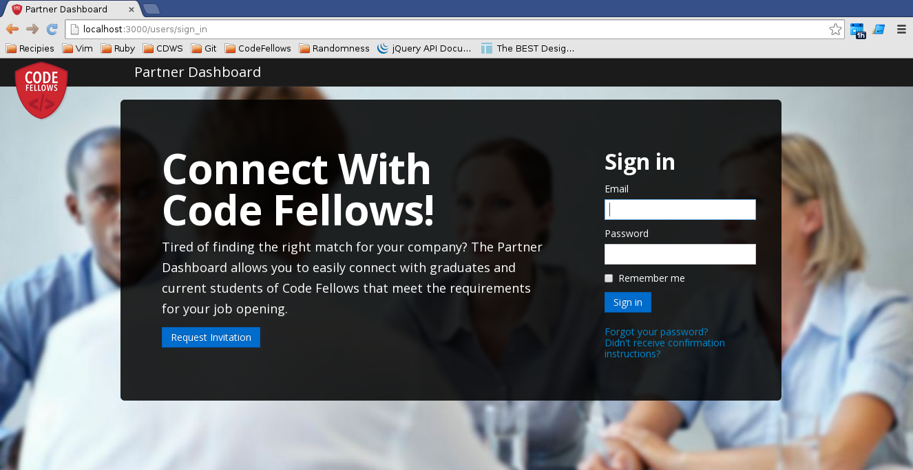
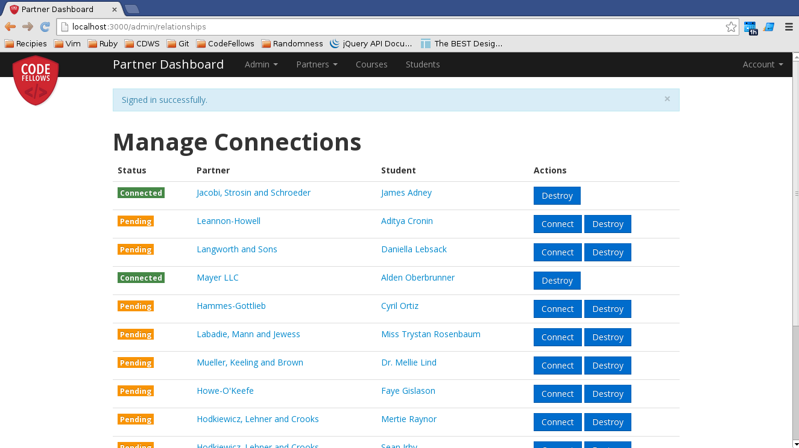
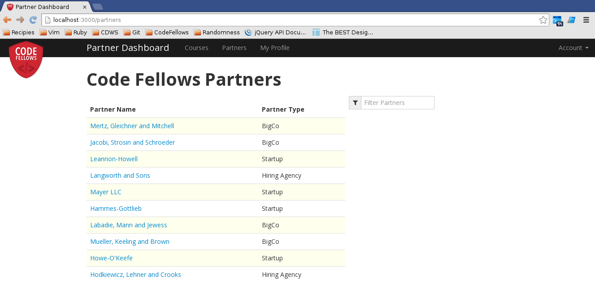
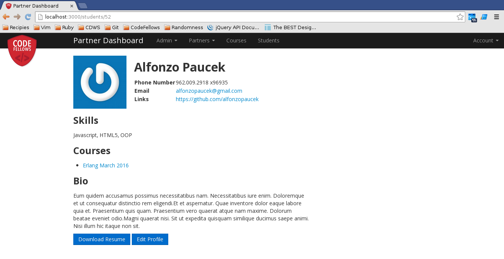

### Partner Dashboard 

**Partner Dashboard** is a course project for bootcamp students of [Code Fellows](www.codefellows.org) to solve a particular business need.  This application serves to connect Codefellow partner companies and contacts with students.  It enables companies to find and request introductions to CodeFellows students who fit open development roles and in the same way allows students to request introductions to partners.  Student, Partner Companies and Professional contacts all have profiles which help facillitate admin introductions.

## Show Me

Screenshots:

## Project Setup

_How do I, as a developer, start working on the project? What dependencies does it have and how do I install them?_
When you try to run `bundle install` on the project, you will run into an error. This application requires:

* capybara-webkit gem, which depends on a WebKit implementation from Qt (version >= 4.8), a cross-platform development toolkit. You can follow the instructions on the [Install Page](https://github.com/thoughtbot/capybara-webkit/wiki/Installing-Qt-and-compiling-capybara-webkit) to install Qt and compile capybara-webkit. For Mac users, please make sure to [install Qt via homebrew.

* rails-erd gem, which depends on a library for visualization of the ERD for the rails-erd gem. This gem is dependent upon Graphviz and install instructions can be found at the Rails ERD [Install Page](http://rails-erd.rubyforge.org/install.html) 

After installing Qt and Graphviz, run `bundle install` as usual.

Then run `db:setup` [1], and you should be good to go! 

_What is the starter account?_
Have a look in the db/seeds.rb for the development login credentials.

_I want to demo this/get a sense of this app with some dummy varibles...What do you have for me?_
To populate the database with a set of test data to get yourself started: in the command line do `rake db:populate` and the sample data from lib/tasks/sample_data.rake will be used to populate your database.

[1] Rake db:setup is used when you are setting up a new db on your app - it is a shortcut for running rake db:create; rake db:schema:load, and rake db:seed.

_How can I get a sense of what the models look like?_
The ERD (Entity-Relation-Diagram) for all of the models can be generated by running `rake erd` and the erd diagram will be found at erd.pdf in the root of the directory. Note: erd_original.pdf is the erd diagram from the initial fork of the project.

### Known Issues

If you discover any bugs, feel free to create an issue on GitHub fork and
send us a pull request.

## Authors

This Extension of the Original By: 
* [Nathalie Steinmetz](www.linkedin.com/in/nathaliesteinmetz)
* [Danielle Tucker](www.linkedin.com/in/dqtucker), and 
* [Kangie Chan](www.linkedin.com/in/kangiechan/)

Original Implemenation By: 
* [Sean Irby](www.linkedin.com/pub/sean-irby/71/b8/5aa) and 
* [James Adney](www.linkedin.com/in/jamesadney).* Your Name (Your Github URL goes here)

## Contributing

1. Fork it
2. Create your feature branch (`git checkout -b my-new-feature`)
3. Commit your changes (`git commit -am 'Add some feature'`)
4. Push to the branch (`git push origin my-new-feature`)
5. Create new Pull Request

## License

The MIT License (MIT)
